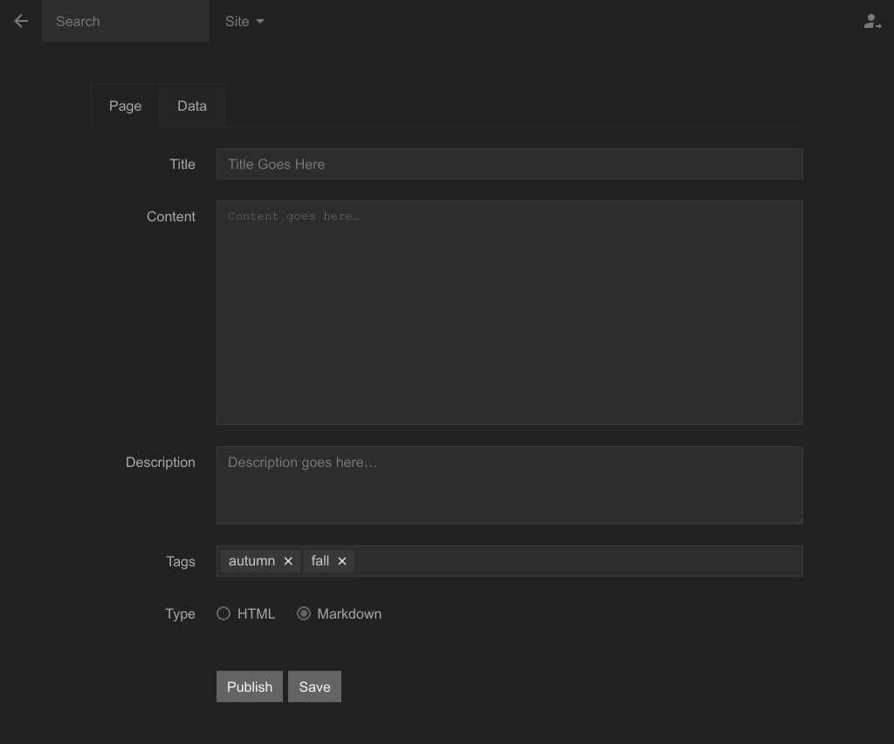

Panel Tag Extension for Mecha’s [Panel](https://github.com/mecha-cms/x.panel)
=============================================================================

This extension adds features to the control panel to make it easier to manage tag files.

Without this extension, the tag menu icon and tags page will look very generic like the assets page:

With this extension, the tags page will look like this:

With the new tags page view, it will of course give a new tag form as well:

A tags field will appear on the page form to allow you to easily add tags to the page. If the tag name doesn’t exist
yet, it will be created automatically when the page is published or modified. You can then change its title and
description later from the tags page:

